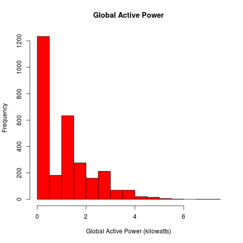
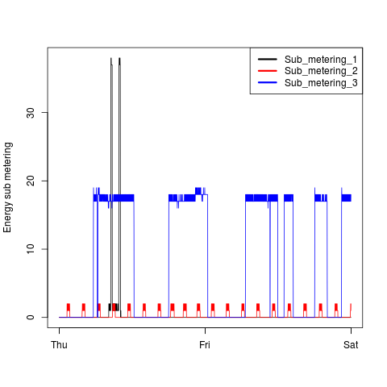
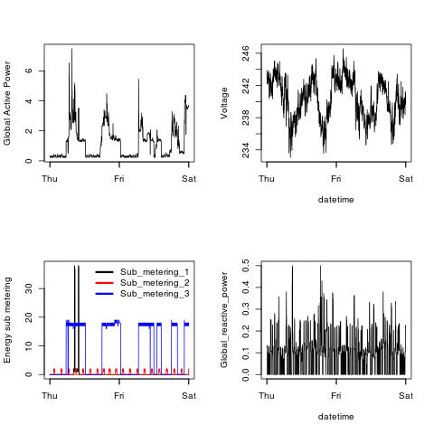

# Exploratory Data Analysis - Project 1

This repository contains my solution of the first project in the
[Coursera](https://www.coursera.org) course exploratory data analysis.

## Contents

The following files have been added/modified compared to the provided
repository.

* **README.md** has been modified to describe my solution, and not the
project assignment.

* **ProjectInfo.md** is the previous version of `README.md`, i.e. the
description of the project assignment.

* **powerdata.R** is an R script to ease reading the required data.
* **plot1.R** is an R script to produce the plot `plot1.png`.
* **plot2.R** is an R script to produce the plot `plot2.png`.
* **plot3.R** is an R script to produce the plot `plot3.png`.
* **plot4.R** is an R script to produce the plot `plot4.png`.

## Instructions

1. Make sure the data is in your working directory.

2. Run the scripts `plot1.R` through `plot4.R` to produce the required
   plots `plot1.png` through `plot4.png`, e.g.
   <code>source("./plot1.R")</code> will produce `plot1.png` in your
   working directory.

## Results

The plot to be reconstructed is shown on top of the plot generated by my code.

### Plot 1

 

### Plot 2

 
 

### Plot 3

 
 

### Plot 4

 
 

